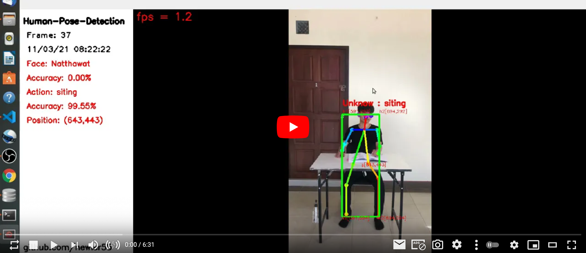
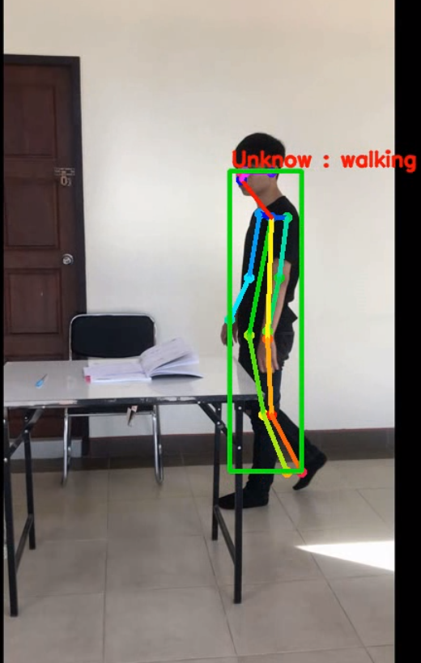
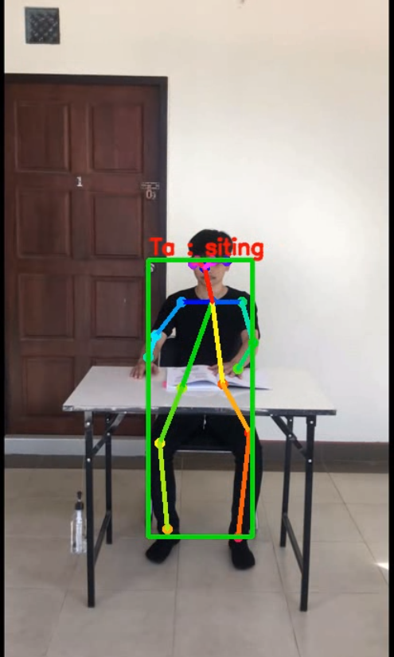
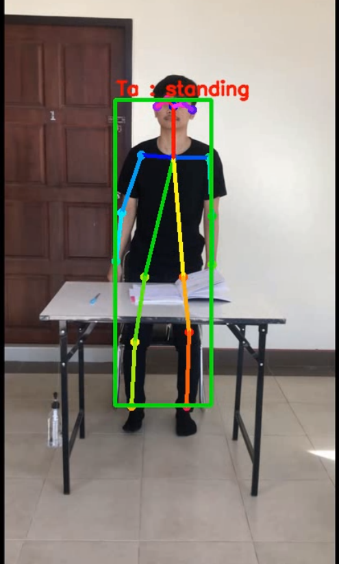
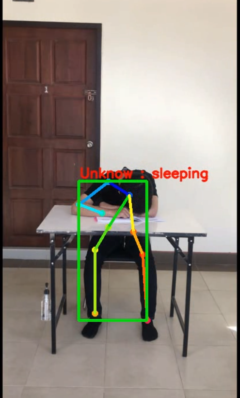
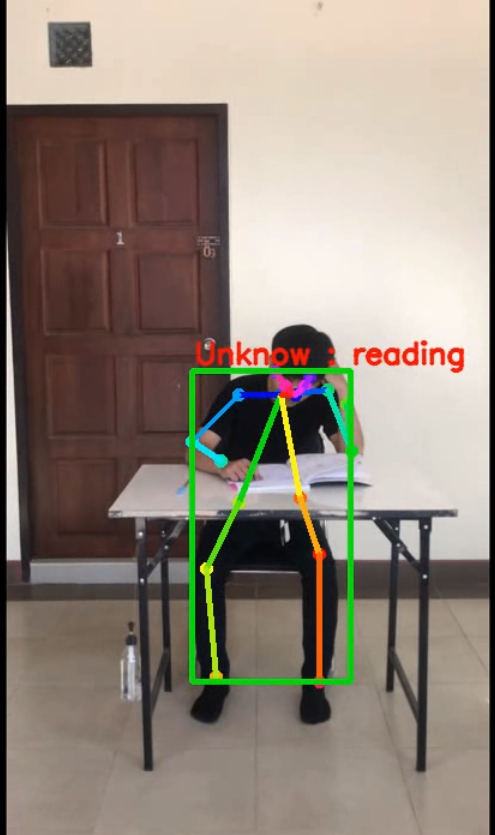
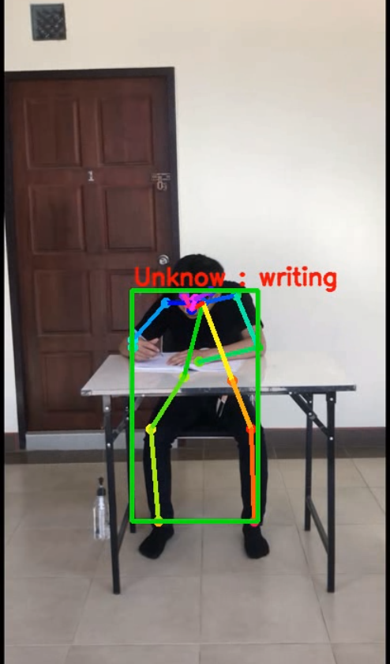
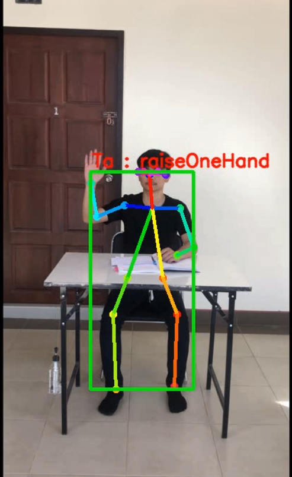

# Human-Pose-Detection

### AI ตรวจจับท่าทางการกระทําในห้องเรียน

โปรเจกต์ HappySchool เป็นระบบที่ช่วยในการพัฒนาการสอนของครู โดยใช้กล้อง 2 ตัว ในการ
ตรวจจับครูและนักเรียน ไม่ว่าจะเป็น การกระทําต่างๆ ความสนใจเรียน อารมรณ์อื่นๆ โดนใช้ AI ภายในห้องเรียน
แล้วมาประมวลผลเพื่อช่วยนําข้อมูลที่ได้มาปรับพัฒนาการสอนในตรงจุดแก่นักเรียนมากขึ้น

### Project details 
https://bit.ly/3ibz9Rx

### Package Install

add file
source : https://drive.google.com/drive/folders/1vpCIaP_wAQlheO81usZWoE1pYA4t8FXt?usp=sharing
```
human-action-recognition/src/githubs/tf-pose-estimation
human-action-recognition/model
human-action-recognition/data_test/tast-01.mp4
```

Refer
See : [felixchenfy/Realtime-Action-Recognition](https://github.com/felixchenfy/Realtime-Action-Recognition)

Reinstall Nvidia Driver && CUDA , CuDNN
See : [doc/nvidia-driver.md](./doc/nvidia-driver.md)

Install tf-pose-estimation
See : [doc/tf-pose-estimation.md](./doc/tf-pose-estimation.md)

Install face-recognition
See : [doc/face-recognition.md](./doc/face-recognition.md)

### DEMO
[](https://www.youtube.com/watch?v=iAAyuDut1Eg "DEMO APP")

### Training model

See : [doc/training.md](./README2.md)

### Test - AI  
```
Example of usage:

(0) Test on Face Recognition
cd src/githubs/face-recognition/
python src/githubs/face-recognition/FaceRecognition.py --video=./data_test/face_test.mp4
python ./FaceRecognition.py --video=./data_test/face_test.mp4
cd ../../../

(1) Test on video file:
python src/s6_test.py \
    --model_path model/trained_classifier.pickle \
    --data_type video \
    --data_path data_test/tast-01.mp4 \
    --output_folder output
    
(2) Test on a folder of images:
python src/s6_test.py \
    --model_path model/trained_classifier.pickle \
    --data_type folder \
    --data_path data_test/apple/ \
    --output_folder output

(3) Test on web camera:
python src/s6_test.py \
    --model_path model/trained_classifier.pickle \
    --data_type webcam \
    --data_path 0 \
    --output_folder output
```

   - class: walking 
     <p align="center"></p>
   - class: siting 
     <p align="center"></p>
   - class: standing 
     <p align="center"></p>
   - class: sleeping 
     <p align="center"></p>
   - class: reading 
     <p align="center"></p>
   - class: writing 
     <p align="center"></p>
   - class: raiseOneHand 
     <p align="center"></p>


