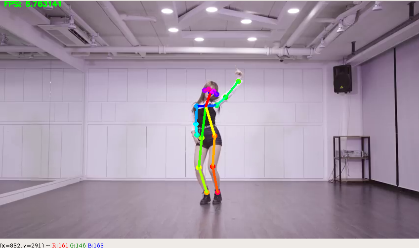

# Install tf-pose-estimation

### Install Miniconda

download : https://drive.google.com/file/d/1PBc5ZYVfwAZ5HVEyJiqAiMhU2icz1F2J/view?usp=sharing
```
$ Bash Miniconda3-latest-Linux-x86_64.sh
```

### Install tf-pose-estimation

```
$ cd Human-Pose-Detection/src/githubs/
$ git clone https://github.com/newler55/tf-pose-estimation.git
$ cd tf-pose-estimation

$ sudo apt install swig
$ cd tf_pose/pafprocess
$ swig -python -c++ pafprocess.i && python3 setup.py build_ext --inplace

$ conda create -n ai python=3.6 pip | conda activate base , conda remove -n ai --all
$ pip install -r requirements.txt
```

Test Inference
```
$ python run_webcam.py
```
<p align="center"></p>

